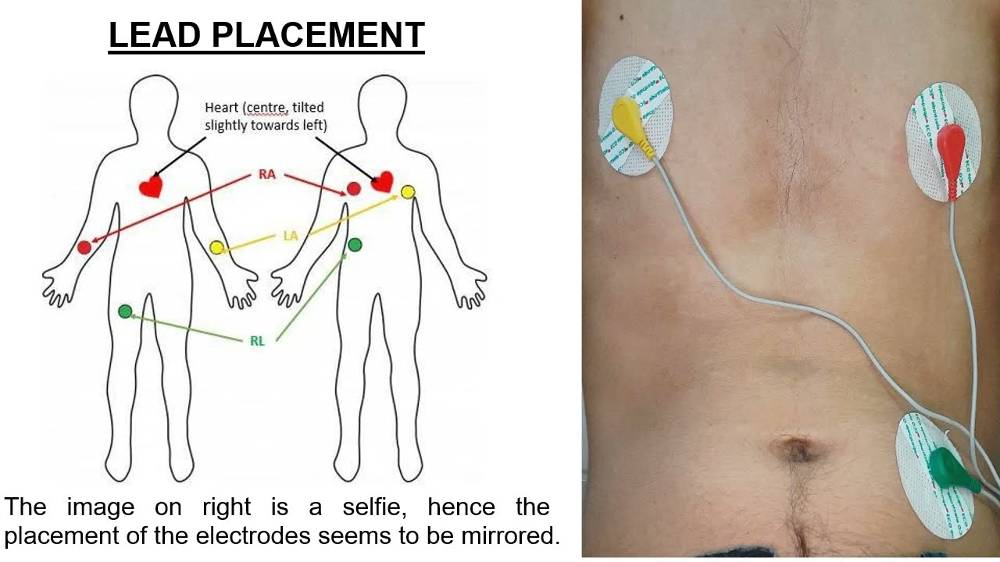
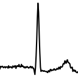
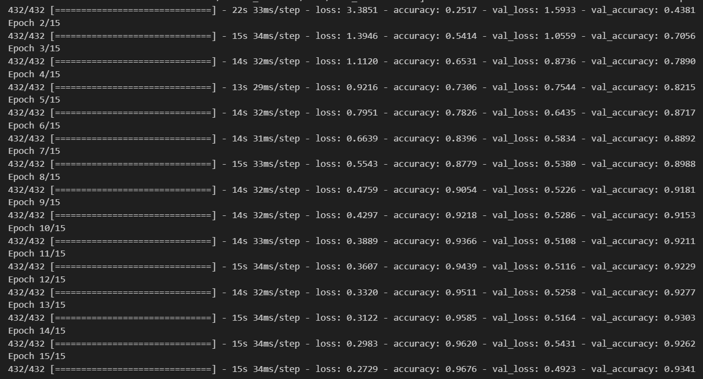

# ECG Classification and Alert System

## Overview
This project implements an ECG classification system using a Convolutional Neural Network (CNN). It uses the MIT-BIH database, a public electrocardiogram repository with 47 unique 2-channel ECG recordings, as a source of data to preprocess into grayscale images of individual heartbeats. These are used to train, test and validate the CNN, which is then utilised in conjunction with a WiFi capable microcontroller and ECG monitor. Together, these parts collect and send a patients ECG data through a local web-socket to be analysed and identified by the CNN. If arrythmia is detected, the user is notified.

## Setup and Installation

1. Clone the repository:
    ```bash
    git clone https://github.com/EthanLynam/arrythmia_detector_cnn.git
    cd /your/repo/directory
    ```

2. Install dependencies:
    ```bash
    pip install -r requirements.txt
    ```

3. **Hardware Requirements**:
    - A **WiFi-capable microcontroller** to collect and send ECG data to the WebSocket server.
    - An **ECG monitor** or sensor to capture ECG data.
    - I used the Arduino nano 33 IoT & AD8232 ECG Sensor.

    
    
    .jpeg)
    
    Ensure the microcontroller is properly set up to collect ECG data from the ECG monitor, to communicate with the server and to send ECG data over the network.

## Running the Project

1. preprocess the data
    - Takes raw ECG data from MIT-BIH, transforms it into 128x128 grayscale images of each heartbeat. Four augmented images also created for each arrhythmia due to lack of arrhythmia data. 225,000 images are created overall.
    ```bash
    cd src/preprocessing
    python generate_images.py
    ```
    
    
    
    
    

2. train and evaluate the cnn model within the jupyter notebook
    ```bash
    cd src/cnn/train_and_evaluate_cnn.ipynb
    ```
    

4. use ecg_websocket_client.ino within microcontroller IDE for client/server communication between microcontroller & local machine.
    ```bash
    cd src/arduino_client
    ```

5. Assuming microcontroller is successfully attempting connection and sending ECG data, start the server.
    ```bash
    cd src/websocket_server
    python server.py
    ```

6. View results in terminal (data is processed in batches, it may take up to 20 seconds).

## View the report

[Report](report.pdf)


